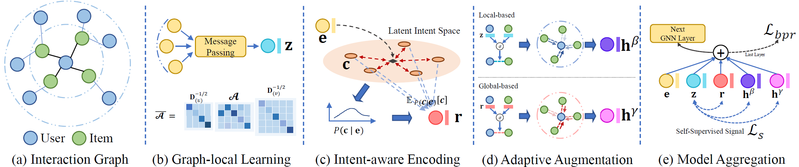

# Disentangled Contrastive Collaborative Filtering

This is the PyTorch implementation by <a href='https://github.com/Re-bin'>@Re-bin</a> for DCCF model proposed in this paper:

 >**Disentangled Contrastive Collaborative Filtering**  
 > Xubin Ren, Lianghao Xia, Jiashu Zhao, Dawei Yin, Chao Huang*\
 >*SIGIR 2023*

\* denotes corresponding author
<p align="center">

</p>

In this paper, we propose a disentangled contrastive learning method for recommendation, which explores latent factors underlying implicit intents for interactions. In particular, a graph structure learning layer is devised to enable the adaptive interaction augmentation, based on the learned disentangle user (item) intent-aware dependencies. Along the augmented intent-aware graph structures, we propose a intent-aware contrastive learning scheme to bring the benefits of disentangled self-supervision signals.

## Environment

The codes are written in Python 3.8.13 with the following dependencies.

- numpy == 1.22.3
- pytorch == 1.11.0 (GPU version)
- torch-scatter == 2.0.9
- torch-sparse == 0.6.14
- scipy == 1.7.3

##  Dataset

We utilized three public datasets to evaluate DCCF:  *Gowalla, Amazon-book,* and *Tmall*. 

Note that the validation set is only used for tuning hyperparameters, and for *Gowalla* / *Tmall*, the validation set is merged into the training set for training.

## Examples to run the codes

The command to train DCCF on the Gowalla / Amazon-book / Tmall dataset is as follows.

We train DCCF with a fixed number of epochs and save the parameters obtained after the final epoch for testing.

  - Gowalla 

    ```python DCCF_PyTorch.py --dataset gowalla --epoch 150```   

  - Amazon-book:

    ```python DCCF_PyTorch.py --dataset amazon --epoch 100```

  - Tmall:

    ```python DCCF_PyTorch.py --dataset tmall --epoch 100```

 **For advanced usage of arguments, run the code with --help argument.**

**Thanks for your interest in our work**

## Reference
```
@inproceedings{ren2023disentangled,
  title={Disentangled contrastive collaborative filtering},
  author={Ren, Xubin and Xia, Lianghao and Zhao, Jiashu and Yin, Dawei and Huang, Chao},
  booktitle={Proceedings of the 46th International ACM SIGIR Conference on Research and Development in Information Retrieval (SIGIR)},
  year={2023}
}
```
